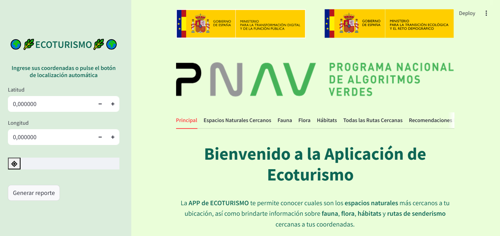
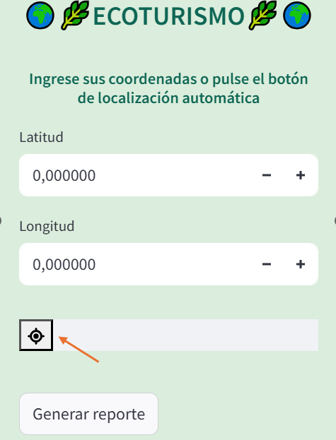
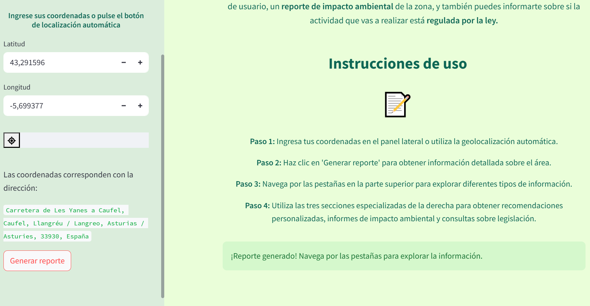
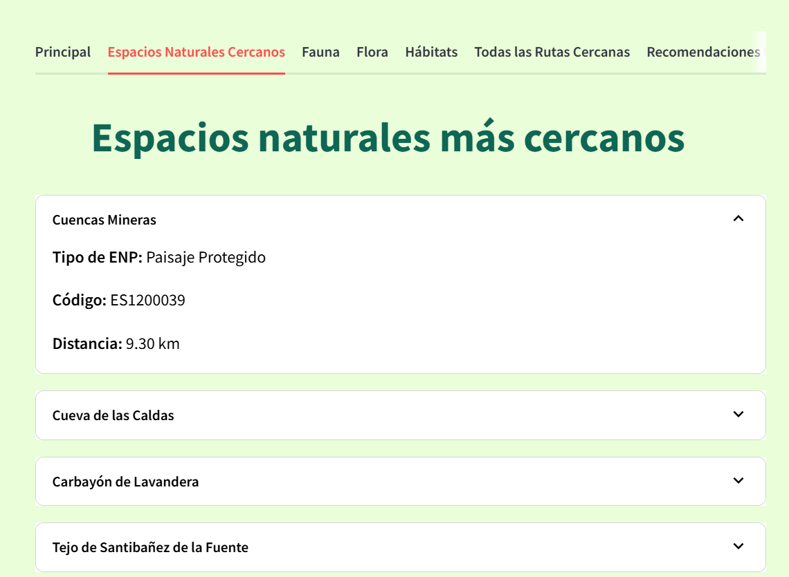
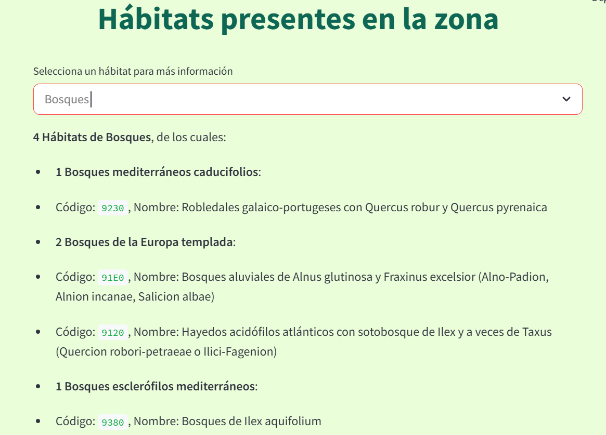
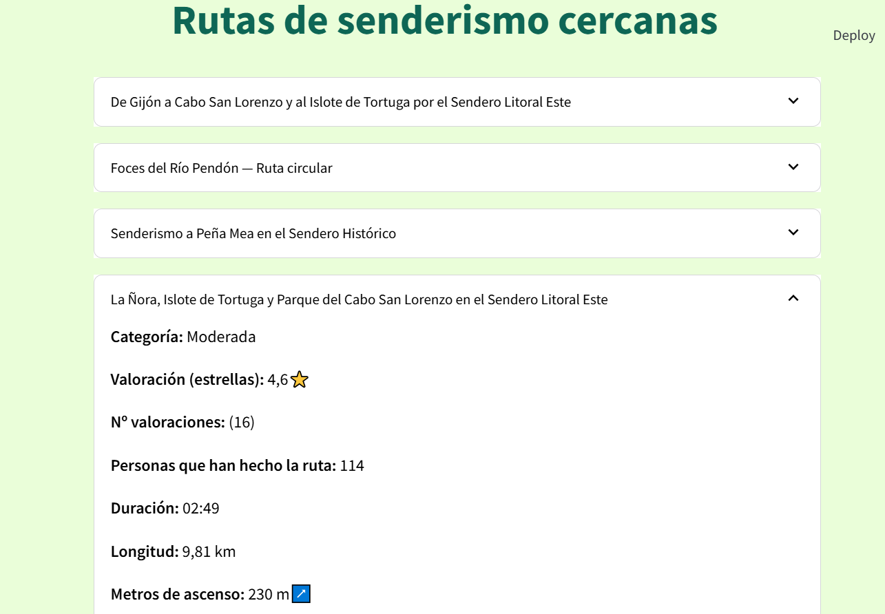
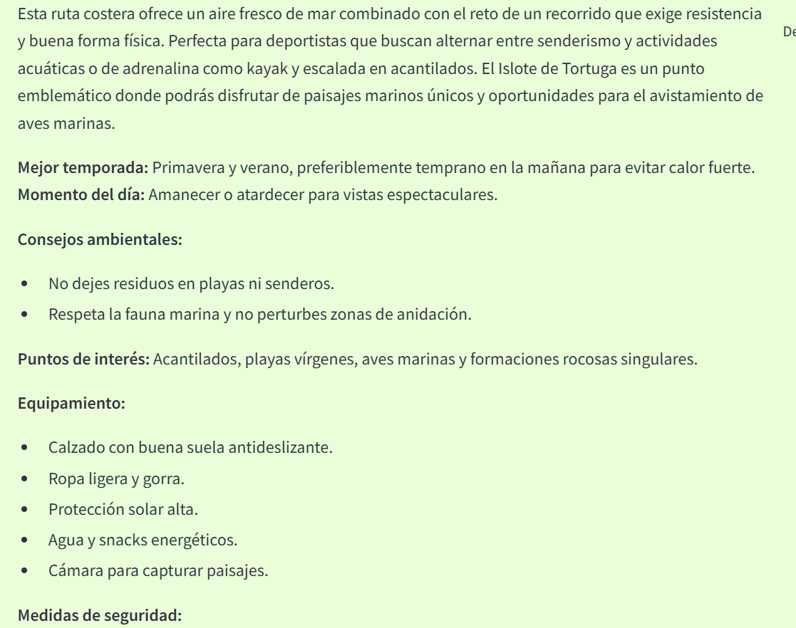
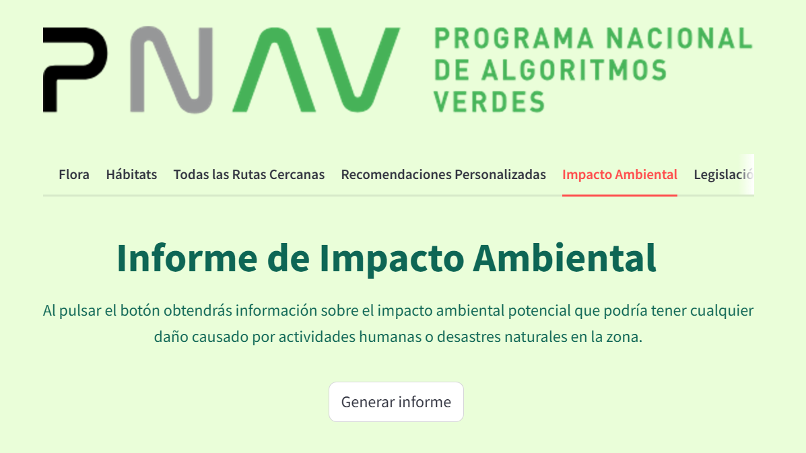
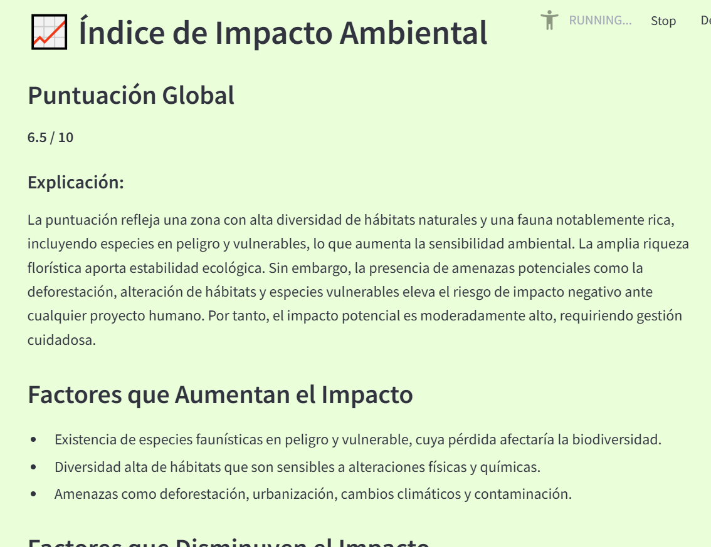
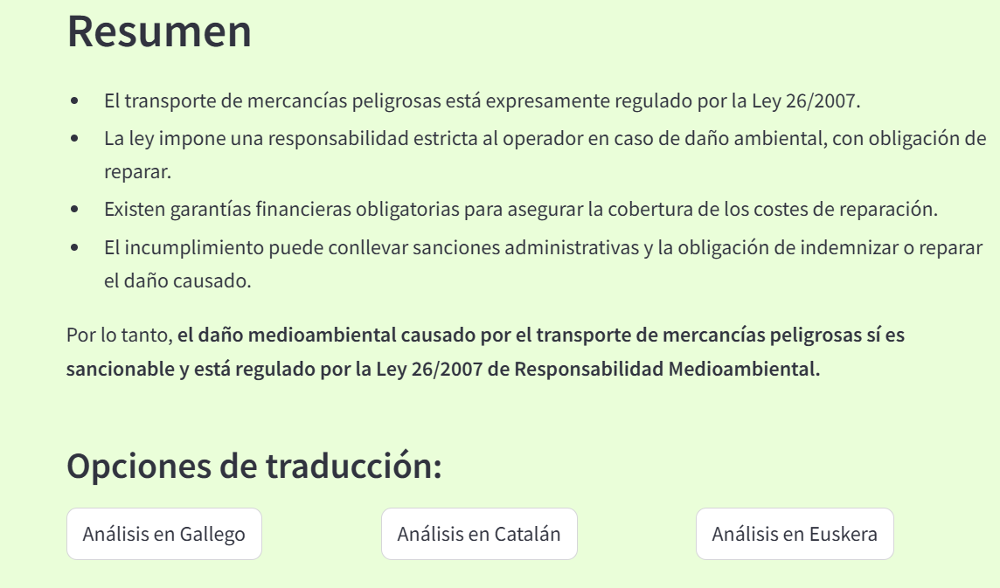

# ECOTURISMO APP

# Índice  

1. [Instalación](#1-instalación)  
2. [Uso](#2-uso)  
3. [Descripción del caso de uso y justificación](#3-descripción-del-caso-de-uso-y-justificación)  
4. [Fuentes y conjuntos de datos generados](#4-fuentes-y-conjuntos-de-datos-generados)  
5. [Metodología y scripts](#5-metodología-y-scripts)  
6. [Modelos de lenguaje utilizados](#6-modelos-de-lenguaje-utilizados)  
7. [Técnicas de optimización energética](#7-técnicas-de-optimización-energética)  

# 1. Instalación  

Para instalar el proyecto **Hackathon Ecoturismo**, sigue estos pasos:  

1. Asegúrate de tener **Python 3.9** o superior instalado en tu sistema.  
2. Crea un nuevo **entorno virtual** y actívalo. 
3. Crea un archivo **.env** e ingresa la **API_KEY** de **Azure GPT-4.1-mini** y su **ENDPOINT** en el archivo.  

Ejemplo de lo que debe incluir el archivo **.env**:

```
API_KEY="apikey_goes_here"
ENDPOINT="endpoint_goes_here"
```

4. Instala las dependencias necesarias usando `pip`: 

```
pip install geopy==2.4.1 numpy==2.0.2 requests==2.32.3 selenium==4.31.0 streamlit==1.44.1 streamlit-geolocation==0.0.10 openai>=1.69.0 codecarbon>=3.0.0 langchain_community==0.3.24
langchain_huggingface== 0.2.0 langchain_core==0.3.60
```


# 2. Uso  

El proyecto **Hackathon Ecoturismo** ofrece un conjunto de herramientas y funcionalidades para apoyar actividades de ecoturismo. Para utilizar el proyecto, puedes ejecutar la aplicación principal con **Streamlit** ingresando el siguiente comando en la terminal:  

```
streamlit run "scripts\app.py"
```


Esto iniciará la aplicación de **Streamlit**, proporcionando una interfaz web para interactuar con las características del proyecto.  
 

---

# 3. Descripción del caso de uso y justificación  

## Caso de uso: Sistema de recomendación de áreas de ecoturismo cercanas.  

## Descripción  
A partir de unas coordenadas, bien ingresadas por el usuario a mano, o bien pulsando en el botón de geolocalización automática, se ha desarrollado un avanzado sistema de recomendación de áreas de ecoturismo cercanas. Este sistema genera un reporte detallado que incluye información sobre los espacios naturales protegidos más próximos (Parques Nacionales, Parques Red Natura, monumentos naturales, etc.) las especies de flora y fauna de interés, los tipos de hábitats existentes y las posibles rutas de senderismo en la zona, además de la distancia de cada una de estas atracciones turísticas.

### Interfaz que se muestra al acceder a la app: 



### Espacio para el ingreso de las coordenadas:  
La flecha naranja indica el botón de geolocalización automática.



### Instrucciones:



### Espacios naturales cercanos:  



### Fauna presente en la zona: 


### Visor de flora presente en la zona:


### Hábitats presentes en la zona:  



### Rutas de senderismo cercanas: 




Utilizando inteligencia artificial generativa, se habilita la posibilidad de crear diferentes reportes adaptados al perfil del usuario. Estos reportes se enfocan en la biodiversidad, en atracciones de aventura o en actividades familiares, basándose en la información recopilada y las preferencias del usuario. La capacidad de la IA generativa para personalizar estos reportes garantiza que cada usuario reciba información relevante y específica, mejorando su experiencia turística. 

### Recomendación personalizada por perfil de usuario para visitar la zona: 

 




Asimismo, se ofrecerá la posibilidad de generar un reporte de impacto ambiental, considerando las características bioecológicas de la zona de interés. La integración de la IA generativa no solo optimiza la personalización de la información, sino que también proporciona una herramienta poderosa para evaluar y mitigar los efectos negativos en el entorno natural. Este informe permite evaluar el impacto potencial de las consecuencias que tendría la explotación humana o una catástrofe medioambiental sobre el área de interés, identificando áreas sensibles, previendo posibles daños y recomendando prácticas sostenibles para la conservación de los recursos naturales. Al facilitar la toma de decisiones informadas y conscientes, este sistema innovador contribuirá significativamente a la preservación del medio ambiente y a la promoción de un turismo responsable y sostenible. 

### Informe de impacto ambiental:  

 

 


Una tercera parte de la aplicación permite evaluar la regulación de ciertas actividades económicas en relación con la Ley de Responsabilidad Medioambiental. Al ingresar una actividad, el sistema identifica si está sujeta a esta normativa y genera un informe sobre sus posibles implicaciones legales. Se presentan aspectos clave como la responsabilidad del operador, la necesidad de adoptar medidas de prevención y reparación, y la posible exigencia de garantías financieras. Además, el informe ayuda a comprender cómo una actividad económica puede impactar el medio ambiente y qué acciones son necesarias para mitigar sus efectos. Así, esta funcionalidad ofrece una herramienta útil para la gestión de riesgos ambientales, promoviendo el cumplimiento normativo y la toma de decisiones responsables. 

### Análisis de ley de responsabilidad medioambiental:  

 


Por último, una funcionalidad clave de la aplicación será la traducción automática de todos los informes generados a catalán, gallego y euskera, utilizando IA generativa. Este sistema permitirá adaptar la información a diferentes usuarios, garantizando el acceso a contenidos clave en su idioma preferido. La traducción se realizará de manera precisa, preservando la estructura y el significado original de los informes, facilitando su comprensión y aplicación en distintos contextos.

### Traduccion de los informe a catalán, gallego y euskera:  




---

## Justificación  
La necesidad de crear un sistema de recomendación de áreas de ecoturismo cercanas surge de la creciente demanda por experiencias turísticas sostenibles y la falta de herramientas que faciliten el acceso a información detallada y personalizada sobre destinos naturales. Actualmente, los turistas enfrentan dificultades para encontrar y planificar visitas a áreas de ecoturismo debido a la dispersión de la información y la falta de recursos centralizados. Además, existe una necesidad urgente de promover la conservación de los ecosistemas naturales y educar a los visitantes sobre prácticas responsables para minimizar el impacto ambiental.  

---

## Impacto diferenciado  

### Económico  
El sistema genera un impacto positivo en la economía local al fomentar el turismo sostenible en áreas naturales cercanas. Al atraer más visitantes informados y conscientes, se impulsan negocios locales como alojamientos, restaurantes, guías turísticos y actividades al aire libre. Además, se promueve la valorización económica de las zonas protegidas al mostrar su relevancia turística y ecológica.  

### Ambiental  
El sistema contribuye a la preservación del medio ambiente al incluir recomendaciones personalizadas para minimizar el impacto de los visitantes en los ecosistemas. Al concienciar sobre la importancia de la fauna, flora y recursos hidrológicos, fomenta un turismo responsable que respeta los hábitats naturales y ayuda a prevenir su deterioro. Esto permite un equilibrio entre el desarrollo turístico y la conservación ambiental.  

### Tecnológico  
La implementación del sistema aprovecha tecnologías avanzadas de IA generativa para crear folletos personalizados que integran datos geográficos, biológicos y turísticos. El uso de técnicas como el análisis de datos geoespaciales y la integración con bases de datos de biodiversidad garantiza una experiencia tecnológica innovadora, eficiente y escalable.  

### Regulatorio  
El sistema apoya el cumplimiento de normativas de conservación, como las establecidas por la Red Natura 2000 y otras legislaciones nacionales e internacionales. También facilita la divulgación de regulaciones locales sobre el uso de espacios protegidos, asegurando que los visitantes sigan buenas prácticas que respeten las restricciones de uso y conservación. Además, permite alinear el desarrollo turístico con las políticas de sostenibilidad y preservación ambiental.  

---

# 4. Fuentes y conjuntos de datos generados 

## Espacios Naturales Protegidos  
Los datos referentes a los parques naturales protegidos en España se obtuvieron de la base de datos proporcionada por el Ministerio para la Transición Ecológica y el Reto Demográfico (MITECO). Esta base de datos, es accesible a través de la página web de MITECO (Espacios Naturales Protegidos). La descarga de estos datos permite obtener archivos en formato GeoJSON, que contienen información geoespacial sobre parques nacionales, reservas naturales, áreas marinas protegidas, monumentos naturales y paisajes protegidos. Esta información es esencial para la visualización y consulta de los espacios protegidos conforme a la normativa nacional y autonómica.  

**Licencia**: Creative Commons-Reconocimiento (CC-by 4.0).

## Red Natura 2000  
La Red Natura 2000 es una red ecológica de áreas de conservación de la biodiversidad en la Unión Europea. Los datos relacionados con la Red Natura 2000 se obtuvieron directamente de la API proporcionada por la administración del evento. La API permite la extracción de información sobre los sitios, hábitats y especies presentes en los espacios de la Red Natura 2000 en la península ibérica. Los datos se descargan en formato CSV, facilitando su integración y análisis. Esta información es crucial para identificar Lugares de Importancia Comunitaria (LIC), Zonas Especiales de Conservación (ZEC) y Zonas de Especial Protección para las Aves (ZEPA).  

**Licencia**: Creative Commons-Reconocimiento (CC-by 4.0).

## Especies de fauna silvestre  
La información sobre las especies de fauna se obtiene principalmente a través de la API de Red Natura 2000, que proporciona datos detallados sobre las especies presentes en estos espacios protegidos de la península ibérica. Esta información se complementa con datos de la Lista Roja de la Unión Internacional para la Conservación de la Naturaleza (UICN), que clasifica las especies amenazadas en España . La Lista Roja de la UICN es una fuente globalmente reconocida que ofrece información sobre el estado de conservación de las especies, incluyendo su distribución, población, hábitat y amenazas. Dichos datos pueden encontrarse en la página web de la UICN (IUCN Red List of Threatened Species). Además, se recopila información adicional a partir de la API de EIDOS, proporcionada por el Inventario Español del Patrimonio Natural y de la Biodiversidad (IEPNB), que ofrece datos sobre la taxonomía, descripción nomenclatura, distribución, hábitats y estado legal de las especies silvestres en España. Toda esta información se obtiene en formato CSV.  

**Licencia**: Creative Commons-Reconocimiento (CC-by 4.0).

## Flora  
Sobre la flora se ha extraído información de la página oficial de Anthos. Un sistema de información en línea que proporciona datos sobre la biodiversidad de las plantas en España, el cual se desarrolló bajo el marco del programa Flora ibérica y tiene como objetivo principal mostrar información botánica de manera accesible para una amplia audiencia. Además, está respaldado por instituciones como el Real Jardín Botánico (CSIC) y la Fundación Biodiversidad. Mediante web scraping se extrajeron listas en formato PDF de la flora presente en cada espacio natural, así como las imágenes disponibles de esta. Por un lado, la información de los PDF se parseó para obtener CSVs con los datos estructurados, posteriormente se unificó toda la información de las especies en un archivo JSON que incluye la lista de especies existentes en cada espacio natural. Por otro lado, las imágenes extraídas se guardaron generando un conjunto de datos que contiene 8400 imágenes de flora.  

**Licencia:** CC-BY-NC 4.0.  
**Referencia:** Anthos. 2025. Sistema de información sobre las plantas de España. Real Jardín Botánico, CSIC - Fundación Biodiversidad. Recurso electrónico en [www.anthos.es](www.anthos.es). Consulta realizada en abril de 2025.  

## Hábitats  
La información sobre los hábitats se obtiene mediante la API de Red Natura 2000, que proporciona datos específicos sobre los hábitats presentes en los espacios protegidos. Esta información se complementa con una recopilación e integración de los diferentes tipos de hábitats existentes en la península ibérica, según el Ministerio para la Transición Ecológica y el Reto Demográfico (MITECO). Los tipos de hábitat de interés comunitario están definidos por la Directiva Hábitats de la Unión Europea y se encuentran detallados en el Manual de Interpretación de los Hábitats de la Unión Europea. Dicha información se puede encontrar en: Tipos de hábitat de interés comunitario.  

**Licencia**: Creative Commons-Reconocimiento (CC-by 4.0).

## Rutas de Senderismo  
Dado que no existe una base de datos oficial sobre las rutas de senderismo, la información se obtiene de la web de Komoot. Esta es una plataforma ampliamente utilizada que ofrece datos detallados sobre rutas de senderismo, incluyendo mapas, itinerarios y guías. La plataforma permite a los usuarios planificar y descubrir rutas personalizadas, facilitando la exploración de diversas regiones y tipos de aventuras al aire libre. Esta información es esencial para proporcionar recomendaciones precisas y atractivas sobre rutas de senderismo cercanas a las coordenadas ingresadas por el usuario.  

Komoot es una plataforma que ofrece datos abiertos al público. Los datos utilizados han sido obtenidos de la sección gratuita de la página y han sido empleados respetando las directrices establecidas por la marca. Además, no han sido utilizados con fines comerciales.  

**Referencia:** Komoot. 2025. Sistema de planificación de rutas y navegación outdoor. Komoot GmbH. Recurso electrónico en [www.komoot.com](www.komoot.com). Consulta realizada en abril de 2025.  

## Legislación medioambiental  

Se ha tomado como referencia el documento BOE-A-2007-18475 - Ley de Responsabilidad Medioambiental, publicado en el Boletín Oficial del Estado, el cual establece el marco legal de responsabilidad ambiental en España. Este documento fue convertido a formato Markdown, permitiendo su procesamiento y análisis estructurado.  

Mediante el uso de LangChain, se desarrolló un sistema de indexación semántica que facilita la consulta eficiente de normativas medioambientales. Se procesó el contenido del documento mediante técnicas de segmentación de texto, asegurando la correcta jerarquización de títulos, subtítulos y secciones.  

Posteriormente, se implementaron las siguientes técnicas RAG:  

1. **Vectorización del Texto con FAISS**  
   - Se construyó un índice semántico con FAISS, permitiendo la recuperación rápida de fragmentos relevantes, para posteriormente generar representaciones numéricas de los textos.  

2. **Almacenamiento estructurado**  
   - Se serializó la información procesada en un archivo JSON (`chunks.json`), asegurando su reutilización en futuras consultas.  

Esta metodología permitió indexar y estructurar el contenido legal generando una base de datos vectorial de embeddings.  

**Licencia**: La información publicada en el Boletín Oficial del Estado (BOE) está sujeta a la Licencia de Reutilización de la Información del Sector Público, regulada por el Real Decreto 1495/2011, que establece las condiciones para la reutilización de datos públicos en España.  

**Referencia:** BOE-A-2007-18475 - Ley 26/2007 de Responsabilidad Medioambiental, Boletín Oficial del Estado, última modificación: 28 de abril de 2021.  


---

# 5. Metodología y scripts  

## Procesamiento de los Espacios Naturales Protegidos (ENP)  
Estos scripts trabajan en conjunto para proporcionar información precisa y detallada sobre los espacios naturales protegidos más cercanos a la ubicación específica proporcionada, ordenados por distancia, mejorando la experiencia del usuario y promoviendo el turismo sostenible de las atracciones turísticas más próximas.  

### Identificación de los ENP más cercanos: `search_ENP.py`  
Este script está diseñado para identificar los espacios naturales protegidos (ENP) más cercanos a una ubicación específica, basada en las coordenadas de latitud y longitud proporcionadas por el usuario.  

- **Input:** Coordenadas geográficas (latitud y longitud).  
- **Proceso:**  
  - Lectura de archivos GeoJSON que contienen información sobre los ENP.  
  - Extracción de datos relevantes de cada sitio, como el centroide, el nombre del sitio, el código del sitio y su designación.  
  - Cálculo de la distancia entre la ubicación proporcionada y cada sitio utilizando la fórmula de Haversine.  
  - Almacenamiento de la información de los sitios y sus distancias en una lista. Ordenación de la lista por distancia.  
- **Output:** Los 5 sitios ENP más cercanos, junto con su información detallada, incluyendo el nombre del sitio, la designación, el código del sitio, la distancia y un enlace de la página europa de la Red Natura200 para más información.  

### Obtención de la descripción: `match_codes_for_description.py`  
Este script se utiliza para obtener la descripción de calidad de un lugar NATURA2000 específico, basado en su código de sitio a partir de los datos obtenidos de la API Red Natura.  

- **Input:** Código de sitio NATURA2000.  
- **Proceso:**  
  - Recuperación de la descripción de calidad del sitio utilizando el código proporcionado.  
- **Output:** Descripción de calidad del sitio NATURA2000, que se añade a la información de los 5 sitios ENP más cercanos si alguno de ellos es un sitio NATURA2000.  

---

## Procesamiento de la información de espacios Red Natura2000  
Estos scripts trabajan en conjunto para proporcionar información precisa y detallada sobre la información del espacio Red Natura más cercano, incluyendo las especies y hábitats presentes en él, proporcionando la base sobre la que se cumplimentará con más información de cada uno.  

### Identificación del espacio Red Natura más cercano: `REDNATURA_site_code.py`  
Este script está diseñado para identificar el espacio Red Natura 2000 más cercano a las coordenadas proporcionadas, utilizando los datos obtenidos de la API de Red Natura.  

- **Input:** Coordenadas geográficas (latitud y longitud) proporcionadas por el usuario.  
- **Proceso:**  
  - Cálculo de Distancia: Uso de la fórmula de Haversine para calcular la distancia entre la ubicación proporcionada y cada sitio Red Natura 2000.  
  - Identificación del Sitio Más Cercano: Determinación del sitio Red Natura 2000 más cercano a las coordenadas proporcionadas.  
- **Output:** Información completa del sitio Red Natura 2000 más cercano.  

### Listado sobre especies y hábitats: `search_NATURAsite_code.py`  
Una vez identificado el espacio Red Natura 2000 más cercano, este script se utiliza para obtener información detallada sobre las especies de fauna presentes y los hábitats en dicho sitio.  

- **Input:** Código del sitio Red Natura 2000.  
- **Proceso:**  
  - Recuperación de Información: Obtención de datos sobre las especies y hábitats presentes en el sitio Red Natura 2000 utilizando el código del sitio.  
- **Output:** Información sobre las especies y hábitats del sitio Red Natura 2000 más cercano.  

---

## Procesamiento de la información sobre la fauna  

Estos scripts trabajan en conjunto para identificar, clasificar y proporcionar información detallada sobre las especies de fauna presentes en los espacios naturales cercanos a la ubicación del usuario. El proceso incluye la categorización de las especies según su grupo taxonómico (**aves, mamíferos, reptiles e invertebrados**), su estado de conservación según la **Lista Roja de la UICN**, y la vinculación con fichas informativas del **IEPNB**, ofreciendo así un completo inventario de la biodiversidad animal que el visitante puede encontrar en su experiencia de ecoturismo.  

### Identificación y clasificación de fauna: `search_species.py`  
Este script se utiliza para buscar y clasificar las especies presentes en el espacio **Red Natura 2000** más cercano, utilizando los datos de la **Red Natura** proporcionados por la API y la **Lista Roja de la UICN**.  

- **Input:** Código del espacio **Red Natura 2000** más cercano.  
- **Proceso:**  
  - Obtener las especies en dicho espacio Natura: Carga de los datos de `NATURA_species.csv` para identificar las especies presentes en el espacio Red Natura 2000.  
  - Clasificación de Especies: Agrupación de las especies en categorías como **Aves, Mamíferos, Reptiles e Invertebrados**.  
  - Obtención de Categorías de Conservación: Uso del archivo CSV de la **UICN** para obtener las categorías de conservación de las especies.  
  - Organización de Información: Creación de un diccionario que incluye el nombre científico de las especies, su conteo por grupo y sus categorías de conservación según la **UICN**.  
- **Output:** Un diccionario que contiene la información organizada de las especies. 

---

### Emparejamiento con nombres de EIDOS: `match_especies_eidos.py`  
Este script se utiliza para **buscar y emparejar** los nombres de las especies presentes en el sitio **Red Natura 2000** más cercano con los datos de `EIDOS_species.csv`, y construir **URLs** a las fichas informativas del **IEPNB**.  

- **Input:** Lista de especies presentes en el sitio **Red Natura 2000** más cercano.  
- **Proceso:**  
  - **Búsqueda Exacta:** Realiza una búsqueda exacta de los nombres de las especies en los datos descargados de **EIDOS**.  
  - **Emparejamiento de Especies:** Si se encuentra una coincidencia exacta, se extrae el **ID** correspondiente y se construye la **URL** a la web del **IEPNB**. Esto permitirá mostrar toda la información relacionada con dichas especies, aún sin estar disponible directamente a través de la **API de EIDOS**.  
  - **Búsqueda Alternativa:** Si no se encuentra una coincidencia exacta, se busca en la columna `nombre_en_dataset` (otros nombres de la especie) y, si eso falla y es necesario, en la columna principal por nombres similares.  
  - **Almacenamiento de Resultados:** Si no se encuentra ninguna coincidencia, la especie se añade al diccionario final con **ID** y **URL** como `None`.  
- **Output:** Un diccionario que contiene la información de las especies más similares encontradas y sus **URLs** correspondientes.  

---

## Procesamiento de la información sobre la flora  

Estos scripts colaboran para recopilar y presentar la flora característica de los espacios naturales cercanos a la ubicación del usuario. El sistema identifica las especies vegetales más representativas, extrae sus imágenes y nombres científicos principales, y los organiza de manera accesible para el visitante. Esta información permite al ecoturista reconocer y apreciar la diversidad vegetal de la zona, así como disfrutar de la experiencia visual que ofrecen las distintas formaciones vegetales presentes en los espacios naturales recomendados.  

### Obtención de la flora presente en cada espacio natural: `flora_images.py`  
Este script se utiliza para buscar imágenes relacionadas con las plantas presentes en un sitio específico de un espacio natural, basándose en archivos JSON con información asociada y en una carpeta que contiene las imágenes.  

- **Input:**  
  - Diccionario con información del sitio que contiene el nombre del sitio bajo la clave `"SITE_NAME"`.  
  - Ruta de dos archivos JSON:  
    - Uno para relacionar el nombre del sitio con el espacio natural correspondiente.  
    - Otro para asociar el espacio natural con una lista de plantas.  
  - Ruta de la carpeta donde se almacenan las imágenes de las plantas.  

- **Proceso:**  
  - **Extracción del Nombre del Sitio:** Se extrae el nombre del sitio desde la clave `"SITE_NAME"` del diccionario de entrada.  
  - **Búsqueda de Coincidencias:** Se busca el espacio natural asociado al nombre del sitio en el primer archivo JSON. Una vez identificado el espacio natural, se busca la lista de plantas asociadas en el segundo archivo JSON.  
  - **Búsqueda de Imágenes:** Para cada planta en la lista:  
    - **Coincidencia Exacta:** Se busca una imagen con el nombre exacto de la planta en la carpeta.  
    - **Regla de Omisión:** Si el nombre de la planta tiene más de tres palabras, no se realiza ninguna búsqueda para evitar ambigüedades.  
    - **Coincidencia Parcial:** Si no hay coincidencia exacta, se buscan imágenes cuyo nombre comience con las primeras dos palabras del nombre de la planta.  
    - Para cada planta, se genera una URL a la imagen (o `None` si no se encuentra).  
  - **Generación de Resultados:**  
    - Si no hay información del espacio natural en los archivos JSON, muestra un mensaje indicando que no hay datos disponibles para el sitio.  
    - En caso contrario, devuelve un diccionario con los nombres de las plantas como claves y las URLs de sus imágenes como valores.  

- **Output:**  
  Un diccionario que contiene los nombres de las plantas asociados al sitio y las URLs de sus imágenes (o `None` si no hay imágenes disponibles).  

---

## Procesamiento de la información sobre hábitats  

Estos scripts se encargan de extraer, clasificar y organizar la información sobre los diversos hábitats presentes en los espacios naturales cercanos a las coordenadas proporcionadas. Mediante el mapeo de códigos oficiales con sus correspondientes descripciones y categorías globales, el sistema genera un inventario estructurado de los ecosistemas presentes en la zona, permitiendo al usuario comprender la riqueza ecológica y paisajística del entorno que planea visitar, fomentando así un turismo consciente y respetuoso con los diferentes ambientes naturales.  

### Obtención de la información de los hábitats: `search_habitat.py`  
Este script se utiliza para extraer y clasificar la información de los hábitats presentes en el sitio **Red Natura 2000** más cercano a las coordenadas proporcionadas.  

- **Input:**  
  - Código del sitio **Red Natura 2000** más cercano.  

- **Proceso:**  
  - **Lectura de Archivos:** Carga de los datos de la **API de Red Natura** para identificar los hábitats presentes en dicho sitio **Red Natura 2000**.  
  - **Mapeo de Hábitats:** Utilización de diccionarios (`habitat_mapping` y `global_terms`) para mapear los códigos de hábitats a sus nombres completos y términos globales según la información obtenida en la web del **Ministerio para la Transición Ecológica y el Reto Demográfico (MITECO)**.  
  - **Clasificación de Hábitats:** Determinación del término global y el sub-término para cada código en la lista de códigos oficiales de hábitats, añadiendo la información del hábitat a un diccionario de clasificación.  
  - **Conteo de Hábitats:** Uso del diccionario de clasificación para contar el número total de hábitats por término global y sub-término, devolviendo un diccionario con estos conteos.  

- **Output:**  
  Un diccionario que contiene la información organizada de los hábitats.  

---

## Procesamiento de la información sobre las rutas de senderismo  

Komoot es una plataforma ampliamente utilizada para la planificación y descubrimiento de rutas de senderismo, ciclismo y otras actividades al aire libre. Contiene información detallada y actualizada sobre diversas rutas, lo que la convierte en una fuente valiosa para este tipo de datos.  

### Obtener información de rutas: `get_routes_komoot.py`  
Este script se utiliza para obtener información en tiempo real sobre las rutas de senderismo más cercanas a las coordenadas proporcionadas por el usuario, realizando **web scraping** en el sitio web **Komoot**.  

- **Input:**  
  - Coordenadas geográficas (**latitud y longitud**) introducidas por el usuario.  

- **Proceso:**  
  - **Interacción con el Navegador:** Utiliza **Selenium** para abrir la página de **Komoot**, desactivar las cookies, seleccionar la barra de búsqueda, ingresar las coordenadas del lugar deseado y realizar la búsqueda.  
  - **Obtención de la URL:** Después de realizar la búsqueda, obtiene la nueva **URL** que contiene las rutas de la localización especificada.  
  - **Extracción de Información:** Extrae información relevante sobre las rutas de senderismo, como **categoría, duración, longitud, descripción** y URL a la página de **Komoot** para dichas rutas.  
  - **Formateo de Datos y Almacenamiento:** Formatea la información extraída en un archivo **JSON** y lo guarda en una ruta específica.  

- **Output:**  
  Un archivo **JSON** que contiene información detallada sobre las **rutas de senderismo cercanas**, incluyendo su **categoría, duración, longitud y descripción**.  

  ---

## Integración de la información  

### Procesamiento: `process_all_info.py`  
Este script permite integrar todos los demás scripts utilizados como módulos para obtener la información correspondiente a cada uno de ellos. Automatiza la recopilación y procesamiento de datos relacionados con la biodiversidad y rutas de senderismo en una ubicación específica.  

- **Input:**  
  - Coordenadas geográficas (**latitud y longitud**) introducidas por el usuario.  

- **Proceso:**  
  - **Definición de Clases:** Define dos clases, `DataSource` y `DataProcessor`.  
    - `DataSource` se utiliza para almacenar información sobre las fuentes de datos.  
    - `DataProcessor` maneja el procesamiento de datos basado en las coordenadas del usuario.  
  - **Búsqueda de Sitios Naturales Protegidos:**  
    - El método `process_data` busca el código y el nombre del sitio más cercano utilizando las coordenadas del usuario.  
    - Si se encuentra un sitio, se almacena la información y se procede a buscar datos adicionales relacionados con dicho lugar, incluyendo información sobre especies y hábitats.  
  - **Extracción de Imágenes de Flora:**  
    - Se extraen imágenes de flora del sitio natural protegido más cercano.  
  - **Búsqueda de Coordenadas:**  
    - Se buscan sitios naturales protegidos cercanos utilizando los archivos **GeoJSON** con los **ENP de España** y el código del sitio **Red Natura** más cercano.  
  - **Búsqueda de Información Detallada:**  
    - Se busca la información sobre especies y hábitats utilizando los **CSV** obtenidos mediante la **API de Red Natura** y se almacena en los atributos correspondientes.  
  - **Obtención de Información de Rutas:**  
    - Se utiliza **Selenium** para automatizar la búsqueda de rutas de senderismo en el sitio web **Komoot**.  
    - Mediante **web scraping**, se extrae la información de las rutas y se guarda en un archivo **JSON**.  
  - **Ejecución del Proceso:**  
    - El método principal de ejecución crea una instancia de `DataProcessor` con las coordenadas del usuario y llama al método `process_data` para iniciar todo el procesamiento de datos y obtener la información de cada categoría mencionada.  

- **Output:**  
  Un **diccionario** que contiene información detallada sobre los **ENP más cercanos, fauna, flora, hábitats y rutas de senderismo** en la ubicación especificada.  
  
  ---

## IA generativa: TAG  

### Procesamiento: `tag.py`  
Este script, concebido como un **TAG**, integra funcionalidades clave relacionadas con la **carga y uso de datos almacenados en archivos JSON**, la **creación de perfiles** a partir de plantillas definidas en archivos `.md`, y la **generación de respuestas** mediante un modelo de lenguaje de **Azure OpenAI**.  

En particular, automatiza la recopilación de información, la **personalización de contenido** basado en perfiles y la producción de **salidas relevantes para usuarios interesados en ecoturismo**. Además, **centraliza las operaciones** mediante el uso de **módulos auxiliares** y archivos de prompts definidos de manera independiente.  

### **Input:**  
- **Archivos JSON:** El script utiliza archivos **JSON** como fuente principal de datos relacionados con rutas de senderismo, espacios naturales protegidos, flora, hábitats y fauna. Estos archivos contienen información previamente procesada y estructurada.  
- **Prompts en archivos `.md`**: Cada perfil o categoría de información está representado por un archivo **`.md`** ubicado en una carpeta llamada **`prompts`**. Estos archivos contienen plantillas de texto con **marcadores dinámicos** para generar contenido adaptado.  

### **Proceso:**  
1. **Carga de Archivos JSON:**  
   - La función `load_json_files` se encarga de cargar información desde archivos JSON ubicados en un directorio específico.  
   - Los archivos cargados incluyen:  
     - `report_routes_info.json`: Información sobre rutas de senderismo.  
     - `report_ENP_info.json`: Detalles de espacios naturales protegidos más cercanos.  
     - `report_flora_info.json`: Datos sobre flora relevante de la región.  
     - `report_habitats_info.json`: Información sobre hábitats disponibles.  
     - `report_species_info.json`: Especies animales relacionadas con la ubicación.  

2. **Generación de Solicitudes al Modelo de Lenguaje (`llm_requests.py`)**  
   - La función `generate_response` del script `llm_requests.py` interactúa con **Azure OpenAI** utilizando el modelo **GPT-4o**.  
   - Procesa mensajes estructurados con un **rol de sistema** y un **prompt definido** por `TAG.py` para obtener respuestas generadas por el modelo.  
   - Implementa **manejo de excepciones** para lidiar con problemas como **límites de solicitudes** (`Error 429`), estableciendo una pausa antes de reintentar.  

3. **Lectura de Prompts desde Archivos `.md`**  
   - La función `read_prompt` lee **plantillas de texto** ubicadas en la carpeta `prompts`.  
   - Usa **marcadores de formato `{}`** dentro de los archivos `.md` para incluir dinámicamente información cargada desde los JSON.  

4. **Definición de Perfiles Personalizados (`get_perfiles`)**  
   - Integra **datos dinámicos** y **plantillas** para generar contenido específico para diferentes perfiles, como:  
     - **Familias o Grupos de amigos**: Basado en el archivo `familiar.md`.  
     - **Aventureros o Deportistas**: Basado en el archivo `deportistas.md`.  
     - **Ornitólogos, Biólogos o Amantes de la Naturaleza**: Basado en el archivo `naturalistas.md`.  
   - Los marcadores en las **plantillas** son reemplazados automáticamente usando el método `.format`, incorporando datos como:  
     - `ENP_info` (Espacios Naturales Protegidos).  
     - `species_info` (Fauna).  
     - `routes_info` (Rutas de senderismo).  
     - `habitats_info` (Hábitats).  
     - `flora_keys` (Nombres clave de flora).  

5. **Impacto Ambiental (`get_impact`)**  
   - Genera un **informe específico de impacto ambiental** utilizando el archivo `impacto_ambiental.md`.  
   - Usa **datos estructurados** para:  
     - **Clasificar hábitats y especies**.  
     - **Identificar amenazas**.  
     - **Calcular un índice de impacto ambiental** en una escala del 1 al 10.  
   - Además, propone **recomendaciones** para **mitigar daños** y **fomentar la conservación**.  

### **Output:**  
- **Perfiles Personalizados:** Recomendación para rutas de senderismo con contenido generado según las características de los perfiles, adaptado a las necesidades del usuario.  
- **Información de Impacto Ambiental:** Texto que evalúa el impacto ambiental que pudiese tener cualquier proyecto, acción o catástrofe ambiental sobre el terreno de la zona basado en la biodiversidad, hábitats y flora extraída del entorno estudiado.  

### **Elementos Clave a Destacar del TAG:**  

1. **Independencia de los Prompts:**  
   - Todos los prompts están almacenados **individualmente** en archivos `.md` dentro de una carpeta llamada `prompts`.  
   - Esto permite:  
     - **Flexibilidad** en la personalización de contenido.  
     - **Separación** del diseño del contenido y la lógica del código.  
     - **Facilidad** para modificar, añadir o eliminar perfiles y categorías.  

2. **Modularidad:**  
   - El script está diseñado de manera **modular**, facilitando la **extensión** o **reutilización** de sus funciones en otros proyectos.  

3. **Automatización e Integración:**  
   - Desde **la carga de datos** hasta **la interacción con un modelo avanzado de lenguaje**, el script **integra múltiples flujos de trabajo en un solo punto de ejecución**.  

---

## IA generativa: RAG  

### Procesamiento del documento legal: `create_embeddings_index.py`  
Este script, haciendo uso del framework **LangChain**, implementa un **sistema de indexación semántica** que procesa documentos legales en formato **Markdown**, extrayendo y estructurando su contenido mediante **técnicas de procesamiento de texto**.  

Utiliza **FAISS** para la creación de un **vectorstore** y **HuggingFaceEmbeddings** para generar **representaciones semánticas** de los fragmentos de texto. Su propósito es permitir **consultas eficientes sobre normativas medioambientales**, facilitando la recuperación de **información clave dentro de un corpus legal**.  

### **Input:**  
- **Archivo Markdown:**  
  - El script toma como entrada un **documento legal** previamente transformado de **PDF a `.md`**, estructurado en **títulos, subtítulos y secciones de contenido**.  

### **Proceso:**  
1. **Carga del Documento Markdown:**  
   - Se abre el archivo legal en formato `.md` y se lee su contenido.  
2. **Segmentación del Contenido:**  
   - Se aplica una **expresión regular** para identificar **títulos, subtítulos y subapartados** dentro del documento.  
   - Se mantiene la **jerarquía estructural** mediante una lógica de contexto (**Título > Subtítulo > Subapartado**).  
   - Se almacenan **fragmentos significativos** en una lista de `Document()` de **LangChain**.  
3. **Almacenamiento de Chunks en JSON:**  
   - Se serializan los **fragmentos de texto procesados** en un archivo `chunks.json`.  
4. **Vectorización del Texto con FAISS:**  
   - Se construye un **índice semántico** utilizando **FAISS**, permitiendo **búsquedas rápidas** dentro del corpus legal.  
   - Se emplea **HuggingFaceEmbeddings** con el modelo `all-MiniLM-L6-v2` para generar **embeddings representativos**.  
   - Se guarda el **índice localmente** para **futuras consultas**.  

### **Output:**  
- **Corpus Segmentado:**  
  - Fragmentos (`chunks`) estructurados de **normativa medioambiental**, indexados semánticamente.  
- **Base de Datos Vectorial:**  
  - Archivo **FAISS** para realizar **búsquedas eficientes** sobre la legislación.  
  - Permite la **recuperación contextual** de normativas basadas en **similitud semántica**.  


### Recuperación de información: `rag.py`  
Este script, utilizando el framework **LangChain**, implementa un **sistema de recuperación aumentada de información** (**RAG**) que permite **realizar consultas eficientes sobre normativas medioambientales**.  

### **Input:**  
- **Consulta del usuario:**  
  - Pregunta relacionada con la **normativa medioambiental**.  
- **Base de Datos Vectorial:**  
  - Índice **FAISS** previamente generado con fragmentos estructurados de legislación.  

### **Proceso:**  
1. **Carga del índice FAISS:**  
   - Se importa el **índice semántico FAISS** desde un **almacenamiento local**.  
   - Se configuran los **parámetros de búsqueda** para optimizar la **recuperación de información**.  
2. **Definición del modelo de embeddings:**  
   - Se emplea **HuggingFaceEmbeddings** con el modelo `all-MiniLM-L6-v2` para **transformar la consulta** del usuario en **representaciones numéricas**.  
3. **Creación de la plantilla de consulta:**  
   - Se genera un **prompt dinámico** en formato de plantilla que **estructura la pregunta del usuario** junto con el **contexto relevante**.  
4. **Ejecución del flujo RAG:**  
   - Se **recuperan los fragmentos relevantes** desde la base de datos **FAISS** por **similitud semántica**, basándose en la consulta del usuario.  
   - Se **genera una respuesta contextual** basada en los **datos extraídos**.  
   - Se aplica el **modelo de lenguaje** para la **elaboración de una respuesta estructurada** en formato **Markdown**.  

### **Output:**  
- **Respuesta Formateada:**  
  - Explicación contextualizada sobre si el **daño medioambiental** causado por una **actividad económica** está sancionado por la **Ley 26/2007 de Responsabilidad Medioambiental**.  
- **Recuperación Semántica:**  
  - **Fragmentos relevantes** del corpus legal utilizados para **fundamentar la respuesta**.  

---

## Desarrollo de front-end  

### Creación de un frontend: `app.py`  
Este script desarrolla una aplicación web en **Streamlit** que permite a los usuarios consultar información sobre **ecoturismo** en función de coordenadas geográficas ingresadas **manualmente** o mediante **geolocalización automática**.  

La interfaz presenta datos sobre **espacios naturales, especies, flora, hábitats, rutas de senderismo y legislación medioambiental**.  

### Input:  
- **Coordenadas geográficas:** Latitud y longitud proporcionadas **manualmente** o **obtenidas automáticamente**.  
- **Información procesada:** Datos relacionados con **ecoturismo, impacto ambiental y legislación**.  

### Proceso:  
1. **Inicialización de la Aplicación:**  
   - Se configura un sistema de **seguimiento de emisiones de carbono** usando **codecarbon**.  
   - Se establece la **estética visual** mediante **CSS personalizado**.  

2. **Geolocalización y Captura de Datos:**  
   - Se usa `streamlit_geolocation` para obtener **coordenadas automáticamente**.  
   - Se convierte la **latitud y longitud** en una **dirección legible** con **geopy**.  

3. **Generación del Reporte de Ecoturismo:**  
   - Se ejecuta el proceso `execute_process()` para **recopilar información**.  
   - Se almacena la información en **JSON** para distintos aspectos como **especies, flora y hábitats**.  

4. **Interfaz Gráfica y Navegación:**  
   - Se crean **pestañas** para visualizar datos en distintas secciones.  
   - Se implementan **botones y selectores** para **personalización de contenido**.  

5. **Generación de Informes:**  
   - **Impacto Ambiental:** Se genera el informe de impacto ambiental haciendo uso del **TAG**.  
   - **Legislación Medioambiental:** Se analiza si una **actividad económica** está regulada por la **Ley 26/2007 de Responsabilidad Medioambiental** usando un **sistema RAG**.  
   - **Recomendaciones de rutas de senderismo por perfil de usuario:** Se generan haciendo uso del **TAG**.  

6. **Traducción Automática:**  
   - Se permite la **traducción de informes** al **Gallego, Catalán y Euskera** mediante un **sistema de respuesta inteligente**.  

### Output:  
- **Interfaz Web Interactiva:** Una aplicación funcional en **Streamlit** que permite **explorar información sobre ecoturismo**.  
- **Reportes Personalizados:** Datos organizados sobre **especies, flora, hábitats y rutas**.  
- **Informe de impacto ambiental**.    
- **Análisis Legal:** Evaluación contextual sobre el **impacto de actividades económicas en la legislación medioambiental**. 
- **Sistema de Traducción:** Opción para **traducir informes al Gallego, Catalán y Euskera**.   

---

# 6. Modelos de lenguaje utilizados  

Se realizaron pruebas en un entorno de **Google Colab** con diferentes modelos de lenguaje utilizando **Ollama**, una plataforma de código abierto diseñada para facilitar la descarga, ejecución y gestión de modelos de lenguaje grande (LLM).  

El propósito de estas pruebas fue analizar la calidad de generación de contenido en diversos ámbitos. Para ello, se proporcionó a los modelos el mismo prompt, originado en el sistema RAG o TAG, que reciben dentro de la aplicación. De esta manera, se busca maximizar la replicabilidad de las respuestas, tomando como referencia la generada por el modelo GPT-4o, que destacó por ofrecer la mejor calidad en términos de precisión y coherencia. 

## 1. Generación de informes en castellano  
- Evaluación de la generación del informe de impacto ambiental.  
- Recomendaciones de rutas de senderismo en función del perfil del usuario.  
- Análisis normativo sobre la sanción de actividades económicas según la legislación medioambiental.  

## 2. Pruebas de traducción  
- Traducción automática de los textos generados a Gallego, Catalán y Euskera.  

## Evaluación de modelos de lenguaje para generación de informes en castellano  

Se sometieron a prueba los siguientes modelos:  

- **GPT-4o (API de Azure):**  
  - **Descripción:**  Modelo avanzado de lenguaje que ofrece respuestas precisas, rápidas y bien estructuradas, ideal para generación de contenido, traducción y análisis de información.
  - **Resultado:** Generación de respuestas perfectas y de máxima calidad.  
  - **Conclusión:** Se utilizará como referencia para evaluar otros modelos.

- **GPT-4.1-mini (API de Azure):**  
  - **Descripción:**  Modelo avanzado significativamente más ligero que GPT-4o, ofrece respuestas precisas, rápidas y bien estructuradas, ideal para generación de contenido, traducción y análisis de información.
  - **Resultado:** Generación de respuestas perfectas y de máxima calidad.  
  - **Conclusión:** Equivalente al modelo GPT-4o.   

- **hdnh2006/salamandra-2b-instruct:**  
  - **Descripción:** Modelo Salamandra de 2 billones de parámetros. Forma parte de la familia ALIA, un conjunto de modelos de inteligencia artificial desarrollados por el Barcelona Supercomputing Center (BSC)  
  - **Resultado:** Respuesta incorrecta y no válida, la peor de todas.  
  - **Tipo de respuesta:** Devuelve una respuesta muy breve, de apenas dos líneas.  

- **cas/salamandra-7b-instruct:**  
  - **Descripción:** Modelo Salamadra de 7 billones de parámetros.
  - **Resultado:** No proporciona información suficiente para la tarea indicada.  
  - **Tipo de respuesta:** Indica que no tiene suficiente conocimiento para responder.  

- **hdnh2006/BSC-LT-salamandra-7b-instruct-gguf:Q8_0:**  
  - **Descripción:** Modelo Salamandra de 7 billones de parámetros con cuantización de 8 bits.
  - **Resultado:** Respuesta correcta pero demasiado resumida, no alcanza la calidad esperada.  

- **llama3.2 (3B):**  
  - **Descripción:** Modelo de 3 billones de parámetros, es un modelo de lenguaje ligero y eficiente desarrollado por Meta, optimizado para tareas de generación de texto y comprensión multilingüe.  
  - **Resultado:** Respuesta válida, pero no respeta el formato indicado ni ofrece una extensión suficiente.  

- **qwen3:4b (4B):**  
  - **Descripción:** Modelo de lenguaje de 4 billones de parámetros, desarrollado como parte de la familia Qwen de Alibaba. Está diseñado para tareas de generación de texto, razonamiento lógico y procesamiento multilingüe.  
  - **Resultado:** Relación calidad-recursos más adecuada. Respuesta válida aunque con algunos detalles faltantes.  

- **qwen3:8b (8B):**  
  - **Descripción:** Modelo Qwen de 8 billones de parámetros.
  - **Resultado:** Respuesta muy buena y válida, pero se priorizaría el modelo qwen3:4b por eficiencia.  

- **gemma3:4b (4B):**  
  - **Descripción:** Gemma 3:4B es un modelo de lenguaje de 4 billones de parámetros desarrollado por Google, parte de la familia Gemma. Está diseñado para tareas de generación de texto, razonamiento y comprensión multilingüe, con soporte para más de 140 idiomas. 
  - **Resultado:** Calidad inferior a qwen3:4b, incluye información irrelevante.  

- **gemma3:12b (12B):**  
  - **Descripción:** Modelo Gemma3 con 12 billones de parámetros.  
  - **Resultado:** Respuesta perfecta, equivalente en calidad a GPT-4o.  

- **deepseek-r1:7b (7B):**  
  - **Descripción:** Modelo de lenguaje de 7 billones de parámetros desarrollado por DeepSeek. Está diseñado para tareas de razonamiento lógico, resolución de problemas matemáticos y toma de decisiones en tiempo real. 
  - **Resultado:** Respuesta no válida, incluye palabras en inglés en la generación de contenido.  

## Evaluación de modelos de lenguaje para traducción  

Se probaron varios modelos en la traducción a Gallego, Catalán y Euskera:  

- **GPT-4o (API de Azure):**   
  - **Resultado:** Traducción perfecta, con uso de lenguaje técnico y formal. 

- **GPT-4.1-mini (API de Azure):**   
  - **Resultado:** Traducción perfecta, con uso de lenguaje técnico y formal. Equivalente a GPT-4o.

- **cas/salamandra-7b-instruct:**    
  - **Resultado:** Traducción no válida, muchas respuestas en español sin traducción adecuada.  

- **BSC-LT/salamandraTA-7B-instruct-GGUF:**  
  - **Descripción:** Modelo Salamandra de 7 billones de parámetros especializado en traducción. 
  - **Resultado:** Traducción perfecta, manteniendo precisión técnica en los textos.  

- **hdnh2006/BSC-LT-salamandra-7b-instruct-gguf:Q8_0:**   
  - **Resultado:** Traducción válida, aunque con vocabulario menos técnico que el modelo especializado en traducción.  

## Conclusión de las pruebas  

Para la generación de informes en castellano, la selección final se inclinó hacia **GPT-4.1-mini**, fundamentada en criterios de eficiencia y calidad. GPT-4.1-mini sobresale en la relación calidad-recursos, superando a cualquier otro modelo disponible. Su capacidad para ofrecer respuestas de alta calidad con un menor consumo computacional lo posiciona como la opción óptima para iniciativas que buscan equilibrar precisión y eficiencia en la generación de contenido.

Dado que este proyecto se enmarca en un hackatón orientado a la conservación del medio ambiente, la elección de **GPT-4.1-mini** frente a **GPT-4o** responde al compromiso de reducir la huella de carbono y garantizar un desarrollo tecnológico alineado con principios de sostenibilidad.  

En comparación, el uso del modelo Salamandra se situó muy por debajo tanto en términos de eficiencia como de calidad. Las pruebas demostraron que su desempeño era sustancialmente inferior tanto en precisión de respuestas como en consumo de recursos, lo que lo hacía inviable para un entorno donde la relación calidad-recursos es clave.

Sin embargo, en futuras implementaciones:  
- **qwen3:4b** podría utilizarse en escenarios con recursos limitados.  
- **gemma3:12b** sería una excelente alternativa si se dispone de recursos suficientes.  
 
Por otro lado, para traducción, se utilizó **BSC-LT/salamandraTA-7B-instruct-GGUF**, que fue el único modelo de la familia Salamandra que cumplió con los requisitos mínimos de calidad, proporcionando respuestas altamente precisas para traducción a gallego, catalán y euskera, equiparables a las de **GPT-4o** o **GPT-4.1-mini.** 
No obstante, en el código proporcionado, se ha optado por integrar **GPT-4.1-mini** en lugar de **BSC-LT/salamandraTA-7B-instruct-GGUF**, debido a que este último requería la apertura de una máquina virtual en Azure, cuya gestión y consumo no podían ser monitoreados con precisión. Para evitar posibles inconvenientes y asegurar que el jurado pudiera ejecutar la aplicación sin dificultades, se consideró más viable utilizar la llamada a la API de **GPT-4.1-mini**, eliminando así la dependencia de la máquina virtual.  


---

# 7. Técnicas de optimización energética  

Se utilizaron las siguientes técnicas de optimización energética para mejorar la eficiencia del proyecto y reducir su impacto ambiental:  

En primer lugar, se aplicaron **estrategias de optimización de código y recursos computacionales**. Implementando **estructuras de datos eficientes**, así como seleccionando **algoritmos de baja complejidad computacional** para reducir el consumo de CPU. Además, se **eliminaron procesos innecesarios**, evitando **cálculos redundantes** y **minimizando la cantidad de iteraciones en bucles**.  

También se aprovecharon **librerías que ya incorporan funciones optimizadas**, como `geopy`, para la **detección de localizaciones**. Esto permitió reducir las **llamadas innecesarias a modelos de lenguaje** y optimizar el **consumo de recursos**.  

Asimismo, antes de ejecutar cualquier código para su prueba, se llevó a cabo un **proceso exhaustivo de revisión y depuración** con el objetivo de **corregir la mayor cantidad de fallos posibles**. Esta estrategia permitió **minimizar significativamente el número de ejecuciones** a lo largo del desarrollo del proyecto, evitando **procesos innecesarios** y asegurando un **uso eficiente de los recursos computacionales**, lo que garantizó que **cada ejecución del código** estuviera **plenamente justificada** y contribuyera de manera **efectiva al avance del proyecto**.  

Se empleó **CodeCarbon** para **cuantificar las emisiones de CO₂** generadas por el proyecto. Gracias a esta herramienta, fue posible **identificar los procesos con mayor consumo energético** y **reducir su ejecución al mínimo necesario**.

Además, siempre se priorizaron modelos de lenguaje ligeros con una buena relación calidad-consumo.

Finalmente, se **gestionó cuidadosamente el uso de servicios en la nube**, evitando la apertura de **instancias innecesarias en Azure**, asegurándose de que **solo fueran utilizadas si realmente fuesen imprescindibles**, sin afectar el desarrollo del proyecto.  

La implementación de estas técnicas contribuyó **significativamente** a la **eficiencia energética del sistema**, optimizando el **uso de recursos** y reduciendo su **huella ambiental**.  

### Emisiones de una ejecución del código final con GPT4o mini:  

- Arrancar la app: 1.602683111143415e-06 kg CO₂eq
- Geolocalización automática: 1.3019803255253162e-06 kg CO₂eq
- Generar reporte: 2.0958849382231063e-06 kg CO₂eq
- Web scraping de rutas: 9.012490505220662e-05 kg CO₂eq
- Informe de recomendación de rutas y actividades por perfil (TAG):0.00011923258841381465 kg CO₂eq
- Informe de impacto ambiental (TAG): 0.00012867474501472153 kg CO₂eq 
- Traducción de texto: 0.00011324003353953964 kg CO₂eq
- Análisis de ley medioambiental (RAG): 2.398643765243307e-05 kg CO₂eq

**Total**: 4.6209141745096774e-04 kg CO₂eq  

Nota: En cada ejecución las emisiones cambian, pero siempre rondan valores aproximados.


